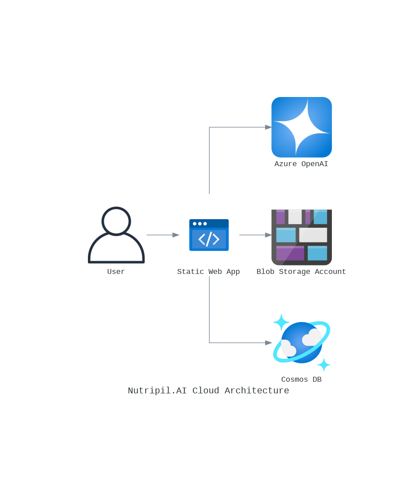

# NutriPilot.AI 🥗

Your AI-powered diet companion that helps you plan, shop, and track your nutrition journey.


## 🤔 The Problem

Maintaining a consistent diet aligned with specific health or fitness goals is challenging:
- Meal planning is time-consuming
- Grocery shopping can be overwhelming
- Tracking calories and macros is tedious
- Adjusting plans for unexpected changes is frustrating

These challenges often lead to diminished motivation and reduced chances of achieving fitness and health goals.

## 💡 Our Solution

NutriPilot.AI is your AI-powered companion designed to take the hassle out of diet management. 

By providing personalized meal plans, guiding your shopping, and tracking your calorie and macronutrient intake, NutriPilot.AI simplifies the process, saving you time and energy while helping you stay consistent and confidently achieve your dietary goals. 

When you can’t meet your plan, NutriPilot.AI provides you a easy way to resync unplanned meals, and recalculate your plan.

NutriPilot.AI takes the hassle out of diet management by serving as your intelligent nutrition companion. Our platform provides:

1. **Smart Meal Planning**: AI-generated, personalized meal plans
2. **Automated Shopping**: Dynamic grocery lists based on your meal plan
3. **Effortless Tracking**: Real-time calorie and macronutrient monitoring
4. **Flexible Adjustments**: Easy resyncing of unplanned meals

When life happens and you can't stick to your plan, NutriPilot.AI helps you easily resync unplanned meals and recalculate your nutrition goals.

## 🔄 How It Works

Our current solution follows a simple yet powerful flow:

1. **Personal Assessment**: Chat with our AI nutrition expert to share your:
   - Fitness goals
   - Physical profile
   - Dietary preferences

2. **Smart Dashboard**: Access your personalized nutrition hub featuring:
   - AI-generated weekly meal plans
   - Goal tracking and progress monitoring
   - Automated shopping lists
   - Easy re-sync of unplaned meals

## 🚀 Quick Start Guide

1. **Access NutriPilot.AI**
   - Visit: [https://purple-coast-03e791f03.5.azurestaticapps.net/dashboard/ykersg](https://purple-coast-03e791f03.5.azurestaticapps.net/dashboard/ykersg)

2. **Complete Initial Assessment**
   - Chat with our nutrition assistant
   - Provide required information about your goals and preferences
   - Pro tip: Use the provided examples in the blue box for testing

3. **Navigate Your Dashboard**
   - Review your personalized calorie and macro goals
   - Manage meals using "confirm" and "remove" actions
   - Track goal updates in real-time

4. **Add Unplanned Meals**
   - Click "Add Meal"
   - Upload images of unplanned meals
   - Let our AI automatically update your plan and your goal tracking

5. **Access Shopping List**
   - Click the shopping list icon in the top right corner
   - View dynamically generated weekly shopping requirements
   - List updates based on unconfirmed meals


# 🎥 Product Demo

[](https://vimeo.com/1032781621/8d431f74ed?share=copy)

## 🗺️ Roadmap

Our vision for NutriPilot.AI extends far beyond its current capabilities. Here's what we're planning:

### 🔬 Technical Enhancements

1. **Custom Vision Models**
   - Advanced food recognition capabilities
   - Precise macro-nutrient calculation from images
   - Multiple food items detection in single image

2. **Data Enhancement**
   - Expanding food database with thousands of items
   - Continuous learning from user interactions
   - Regional food recognition

### Expected Outcomes ✨
- More accurate nutrition tracking
- Faster meal logging
- Better user experience
- Improved personalization


### 🎯 Smart Goal Adaptation
- **Dynamic Meal Recalculation**: When unplanned meals occur, automatically adjust future meals to keep users on track with their goals
- **Enhanced Personalization**: Adapt meal generation based on:
  - Lifestyle patterns
  - Progress rate preference
  - Cooking expertise
  - Kitchen equipment
  - Time availability
  - Cultural preferences
  - Activity level and exercise routine
  - Motivational factors and personal drivers
  - Food allergies and intolerances
  - Food preferences and dislikes
  - Typical eating-out patterns
  - Weekend flexibility needs


### 👨‍👩‍👧‍👦 Family & Group Support
- Multi-user meal planning
- Shared shopping lists
- Family-friendly recipe suggestions
- Group goal tracking

### 🛒 Shopping Experience Enhancement
- **Retail Integration**: Direct integration with online grocery stores
- **One-Click Shopping**: Convert meal plans to online shopping carts
- **Smart Storage Management**:
  - Ingredient tracking
  - Spoilage prevention
  - Waste reduction
  - Pantry optimization


## 💰 Business Model

### Subscription-Based Core
We plan to operate on a subscription model with tiered pricing to provide value across different user needs.

### Additional Revenue Streams

| Stream | Description |
|--------|-------------|
| Expert Consultations | One-on-one sessions with specialized dietitians for custom meal plans |
| Nutrition Kits | Branded equipment including portion control tools and kitchen scales |
| Retail Integration | Partnerships with grocery delivery services for seamless shopping |
| Smart Advertising | Non-intrusive ads in free tier, removable with paid subscriptions |
| Brand Collaborations | Revenue sharing with recommended food and supplement brands |

Our multi-stream approach ensures sustainable growth while maintaining focus on user value and experience.

## 🎯 Go-To-Market Strategy

### Our Approach
NutriPilot.AI targets health-conscious individuals through strategic gym partnerships, transforming how nutrition guidance is delivered in fitness centers.

### Two-Phase Strategy

#### 1. Initial B2B2C Launch 🚀
- **Market**: Portuguese fitness centers
- **Key Partners**: Established chains (Fitness Hut)
- **Model**: Integration with gym memberships
- **Goal**: Build credibility and gather user feedback

#### 2. B2C Expansion 📈
- Leverage gym success stories
- Scale to direct consumer market
- Continuous product improvement
- Expanded feature offerings
   

## 📊 Market Opportunity

### Market Overview
- **Global Diet & Nutrition Industry**: $430 billion
- **Our Target Market**: $22 billion
  - Diet Management Services
  - Personalized Nutrition
  - Wellness Apps
- **Similar Apps Market**: $315 million

### Growth Potential
- Industry expected to reach $850 billion by 2034
- Our segment projected to grow 350% by 2032

## 🔍 Competitor Analysis

| Core Features | NutriPilot.AI | FitnessPal |
|--------------|---------------|-------------|
| Shopping List Generation | ✅ | ❌ |
| Meal Tracking | ✅ | ✅ |
| AI-Based Meal Suggestions | ✅ | ❌ |
| User Macro Goals | ✅ | ✅ |
| Easy Resync of Unplanned Meals | ✅ | ❌ |

### Our Edge ⭐

While FitnessPal offers basic features like meal tracking and macro goals, NutriPilot.AI provides a more comprehensive solution:

- **AI-Powered Planning**: Automated meal suggestions vs. manual planning
- **Shopping Support**: Integrated list generation that FitnessPal lacks
- **Smart Features**: Easy meal resyncing capabilities

## 🏗️ Technical Architecture

### Cloud Arquiteture
We are using azure for the project presented, our solution follows the following guidelines.

<div style="height: 350px; width: auto; overflow: hidden">
  
</div>

### Front-End Project Structure

```
├── app/            # Setup (eg: root element and route)
├── Components/     # UI components with minimal logic
├── Infrastructure/ # External system connections
│   ├── Clients/    # External system clients
│   ├── Cache/      # Caching system configurations
│   └── Models/     # Request/Response models
├── Services/       # Business logic layer
├── Interface/      # Application pages
└── Utils/         # Helper functions and UI theming
```

## 👥 Our Team

### Byte Chefs

**[João Martinho Marques](https://www.linkedin.com/in/joao-marques95/)** - Backend Developer in telecom industry

**[Marcelo Mendes](https://www.linkedin.com/in/marcelomanteigas/)** - Co-Founder & CTO at Networkme